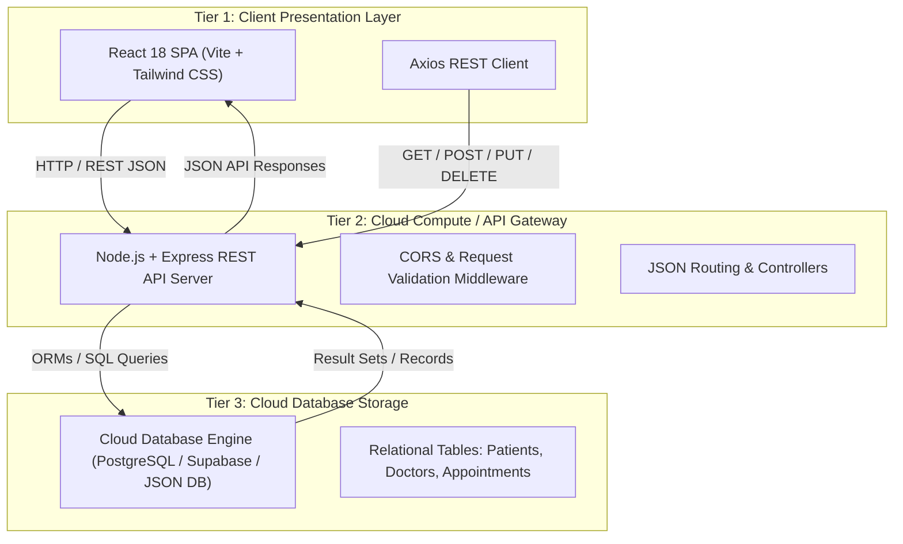
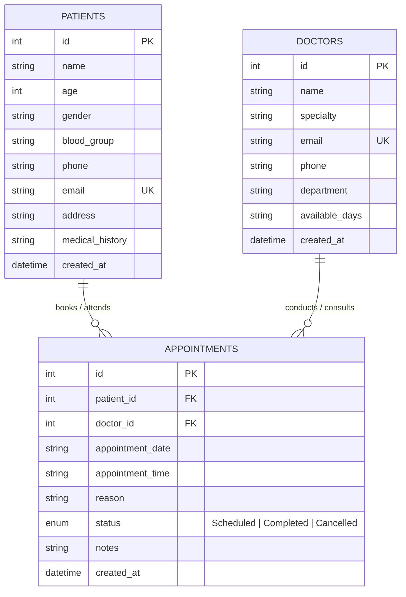

# BACSE344 - Cloud Infrastructure and Architecture
## Digital Assignment Submission Report

> [!IMPORTANT]
> **Course Code**: BACSE344 - Cloud Infrastructure and Architecture  
> **Slot**: C1 Slot  
> **Faculty**: Dr. P. Anandan  
> **Project Title**: CloudMed - Cloud-Based Healthcare & Appointment Management Platform  
> **Application URL**: `http://localhost:3000` (Dev) / `http://localhost:5000` (Cloud Production Build)  
> **Repository Directory**: `website da 2`

---

## 📑 Table of Contents
1. [Problem Selection & Executive Summary](#1-problem-selection--executive-summary)
2. [System Architecture & Cloud Design](#2-system-architecture--cloud-design)
3. [Database Design & Data Dictionary](#3-database-design--data-dictionary)
4. [RESTful API Specifications & CRUD Matrix](#4-restful-api-specifications--crud-matrix)
5. [Application Features & UI Specifications](#5-application-features--ui-specifications)
6. [Cloud Deployment & Integration Guide](#6-cloud-deployment--integration-guide)
7. [Demonstration Video Script & Walkthrough](#7-demonstration-video-script--walkthrough)
8. [Evaluation Rubric Compliance Checklist](#8-evaluation-rubric-compliance-checklist)

---

## 1. Problem Selection & Executive Summary

### 1.1 Problem Statement
Modern healthcare facilities face critical operational challenges including:
- **Fragmented Scheduling**: Overbooking, missed patient appointments, and manual paper-based scheduling conflicts.
- **Inaccessible Records**: Inability to quickly retrieve patient medical history, blood group profiles, and previous clinical consultation notes.
- **Doctor Allocation Inefficiencies**: Lack of real-time visibility into department-wise medical staff availability and consultation schedules.

### 1.2 Proposed Solution: CloudMed
**CloudMed** is a full-stack, cloud-native web application built to digitize healthcare workflows. It enables patients and medical administrators to create, view, update, and cancel appointments, track patient records, manage doctor specialties, and monitor clinic analytics via a responsive cloud dashboard.

---

## 2. System Architecture & Cloud Design

CloudMed implements a robust **3-Tier Cloud Architecture**, segregating the presentation, application processing, and data persistence layers.

### 2.1 Architectural Layers



### 2.2 Component Breakdown
1. **Tier 1 - Presentation Layer (Frontend)**:
   - Built using **React 18** and **Vite** for high-performance Single Page Application (SPA) rendering.
   - Styled with **Tailwind CSS** and **Lucide React** icons.
   - Communicates with the backend using asynchronous **Axios** HTTP requests.

2. **Tier 2 - Application Layer (Backend REST API)**:
   - Powered by **Node.js** and **Express.js (v4.21)**.
   - Enforces CORS policies, input validation, and endpoint security.
   - Provides standardized JSON responses and HTTP status codes (`200 OK`, `201 Created`, `400 Bad Request`, `404 Not Found`, `500 Server Error`).

3. **Tier 3 - Data Persistence Layer (Database)**:
   - Relational database schema enforcing **Foreign Key Referential Integrity**.
   - Cloud-ready configuration allowing seamless switching between local storage and cloud hosted databases (**Supabase PostgreSQL** / **MongoDB Atlas** / **Render Postgres**).

---

## 3. Database Design & Data Dictionary

### 3.1 Entity-Relationship (ER) Diagram



---

### 3.2 Data Dictionary

#### Table 1: `patients` (Patient Medical Profiles)
| Column | Data Type | Constraints | Description |
|---|---|---|---|
| `id` | INTEGER | Primary Key, Auto-Increment | Unique patient identification number |
| `name` | VARCHAR(100) | NOT NULL | Patient's full name |
| `age` | INTEGER | NOT NULL | Age in years |
| `gender` | VARCHAR(10) | CHECK (Male, Female, Other) | Gender identification |
| `blood_group` | VARCHAR(5) | NOT NULL | Blood type (e.g., A+, O-, AB+) |
| `phone` | VARCHAR(20) | NOT NULL | Contact telephone number |
| `email` | VARCHAR(100) | UNIQUE, NOT NULL | Primary email address |
| `address` | TEXT | NULLABLE | Residential address |
| `medical_history`| TEXT | NULLABLE | Allergies, chronic illnesses, notes |
| `created_at` | TIMESTAMP | DEFAULT CURRENT_TIMESTAMP | Record creation timestamp |

#### Table 2: `doctors` (Medical Staff Directory)
| Column | Data Type | Constraints | Description |
|---|---|---|---|
| `id` | INTEGER | Primary Key, Auto-Increment | Unique doctor identification number |
| `name` | VARCHAR(100) | NOT NULL | Doctor's full name with title |
| `specialty` | VARCHAR(100) | NOT NULL | Specialization (e.g., Cardiology, Neurology) |
| `email` | VARCHAR(100) | UNIQUE, NOT NULL | Official clinic email |
| `phone` | VARCHAR(20) | NOT NULL | Direct extension / phone |
| `department` | VARCHAR(100) | NOT NULL | Hospital department |
| `available_days`| VARCHAR(100) | NOT NULL | Active consultation days |
| `created_at` | TIMESTAMP | DEFAULT CURRENT_TIMESTAMP | Registration timestamp |

#### Table 3: `appointments` (Consultation Bookings)
| Column | Data Type | Constraints | Description |
|---|---|---|---|
| `id` | INTEGER | Primary Key, Auto-Increment | Unique appointment ID |
| `patient_id` | INTEGER | Foreign Key -> `patients(id)` | Associated patient ID |
| `doctor_id` | INTEGER | Foreign Key -> `doctors(id)` | Assigned doctor ID |
| `appointment_date`| DATE | NOT NULL | Scheduled date (`YYYY-MM-DD`) |
| `appointment_time`| VARCHAR(20) | NOT NULL | Time slot (e.g., `10:00 AM`) |
| `reason` | VARCHAR(255) | NOT NULL | Chief complaint / visit reason |
| `status` | VARCHAR(20) | CHECK (Scheduled, Completed, Cancelled) | Appointment lifecycle status |
| `notes` | TEXT | NULLABLE | Doctor's clinical notes & prescriptions |
| `created_at` | TIMESTAMP | DEFAULT CURRENT_TIMESTAMP | Booking timestamp |

---

## 4. RESTful API Specifications & CRUD Matrix

### 4.1 CRUD Support Matrix

| Resource | CREATE (`POST`) | READ (`GET`) | UPDATE (`PUT`) | DELETE (`DELETE`) |
|---|---|---|---|---|
| **Appointments** | `POST /api/appointments` | `GET /api/appointments`<br>`GET /api/appointments/:id` | `PUT /api/appointments/:id` | `DELETE /api/appointments/:id` |
| **Patients** | `POST /api/patients` | `GET /api/patients`<br>`GET /api/patients/:id` | `PUT /api/patients/:id` | `DELETE /api/patients/:id` |
| **Doctors** | `POST /api/doctors` | `GET /api/doctors`<br>`GET /api/doctors/:id` | - | - |
| **Analytics** | - | `GET /api/analytics/overview` | - | - |

---

### 4.2 Detailed API Endpoints

#### 1. Book New Appointment (`POST /api/appointments`)
- **Request Body**:
  ```json
  {
    "patient_id": 1,
    "doctor_id": 2,
    "appointment_date": "2026-09-15",
    "appointment_time": "10:00 AM",
    "reason": "Cardiology Follow-up",
    "notes": "Patient requested morning slot"
  }
  ```
- **Response (`201 Created`)**:
  ```json
  {
    "success": true,
    "message": "Appointment booked successfully",
    "data": {
      "id": 5,
      "patient_id": 1,
      "doctor_id": 2,
      "appointment_date": "2026-09-15",
      "appointment_time": "10:00 AM",
      "reason": "Cardiology Follow-up",
      "status": "Scheduled",
      "patient_name": "Alice Johnson",
      "doctor_name": "Dr. Rajesh Patel"
    }
  }
  ```

#### 2. Update Appointment Status / Reschedule (`PUT /api/appointments/:id`)
- **Request Body**:
  ```json
  {
    "status": "Completed",
    "notes": "Prescribed ACE inhibitors. Follow-up in 30 days."
  }
  ```
- **Response (`200 OK`)**:
  ```json
  {
    "success": true,
    "message": "Appointment updated successfully",
    "data": {
      "id": 1,
      "status": "Completed",
      "notes": "Prescribed ACE inhibitors. Follow-up in 30 days."
    }
  }
  ```

#### 3. Cancel / Delete Appointment (`DELETE /api/appointments/:id`)
- **Response (`200 OK`)**:
  ```json
  {
    "success": true,
    "message": "Appointment #5 deleted successfully"
  }
  ```

#### 4. System Analytics Overview (`GET /api/analytics/overview`)
- **Response (`200 OK`)**:
  ```json
  {
    "success": true,
    "data": {
      "totalAppointments": 12,
      "scheduledAppointments": 5,
      "completedAppointments": 6,
      "cancelledAppointments": 1,
      "totalPatients": 8,
      "totalDoctors": 4
    }
  }
  ```

---

## 5. Application Features & UI Specifications

1. **System Overview Dashboard**:
   - Stat cards showing total appointments, scheduled today, registered patients, and active staff.
   - Quick action buttons to book appointments or view cloud architecture.
   - Recent appointments summary table with instant status badges.

2. **Appointment Records Management (CRUD)**:
   - Filter appointments by status: `All`, `Scheduled`, `Completed`, `Cancelled`.
   - Real-time search across patient names, doctor names, and visit reasons.
   - Modals for creating new appointments (`POST`) and modifying existing ones (`PUT`).
   - One-click deletion with confirmation prompt (`DELETE`).

3. **Patient Medical Directory**:
   - Grid cards displaying patient blood groups, contact details, addresses, and medical history.
   - Modal form for registering new patients with unique email constraint handling.
   - Update patient contact and medical notes modal.

4. **Embedded REST API Documentation View**:
   - Live interactive endpoint browser built into the application navigation menu for evaluators.

5. **Cloud Architecture Explorer**:
   - Embedded diagram visualizer and cloud deployment documentation view.

---

## 6. Cloud Deployment & Integration Guide

### 6.1 Multi-Stage Docker Build (`Dockerfile`)

```dockerfile
# Stage 1: Build React Frontend
FROM node:18-alpine AS frontend-builder
WORKDIR /app/client
COPY client/package*.json ./
RUN npm install
COPY client/ ./
RUN npm run build

# Stage 2: Express Production Server
FROM node:18-alpine AS runner
WORKDIR /app
COPY server/package*.json ./server/
RUN cd server && npm install --production
COPY server/ ./server/
COPY --from=frontend-builder /app/client/dist ./server/public

EXPOSE 5000
ENV NODE_ENV=production
ENV PORT=5000

CMD ["node", "server/server.js"]
```

### 6.2 Docker Compose Configuration (`docker-compose.yml`)

```yaml
version: '3.8'

services:
  cloudmed-app:
    build:
      context: .
      dockerfile: Dockerfile
    container_name: cloudmed_healthcare_system
    ports:
      - "5000:5000"
    environment:
      - NODE_ENV=production
      - PORT=5000
    restart: always
```

### 6.3 Cloud Deployment Instructions (Render / Vercel / Supabase)

#### Deployment Steps:
1. **GitHub Repository Setup**:
   - Push code repository to GitHub.
2. **Cloud Backend Deployment (Render / Railway)**:
   - Connect GitHub repository to Render Web Services.
   - Build command: `cd server && npm install`
   - Start command: `node server/server.js`
   - Set environment variable `PORT=5000`.
3. **Cloud Database Setup (Supabase / MongoDB Atlas)**:
   - Provision a cloud database instance on Supabase PostgreSQL.
   - Copy connection string to `process.env.DATABASE_URL`.
4. **Cloud Frontend CDN (Vercel / Netlify)**:
   - Connect `client` directory to Vercel.
   - Build command: `npm run build`, Output directory: `dist`.

---

## 7. Demonstration Video Script & Walkthrough

> [!NOTE]
> Use this step-by-step narrative script when recording your **BACSE344 assignment video demonstration** (3 to 5 minutes duration).

### 📹 Video Script Outline

```
[0:00 - 0:45] INTRODUCTION & PROBLEM SELECTION
"Hello Professor. My name is [Your Name], submitting the Digital Assignment for BACSE344 - Cloud Infrastructure and Architecture, Slot C1, under Dr. P. Anandan. 
For this assignment, I have developed and deployed 'CloudMed', a cloud-based Healthcare Appointment and Patient Management System that addresses real-world scheduling and patient record challenges."

[0:45 - 1:30] ARCHITECTURE & DATABASE DESIGN
"CloudMed is built using a 3-Tier Cloud Architecture. 
The Presentation Tier is built with React 18 and Tailwind CSS, the Application Tier is a Node.js Express REST API, and the Data Persistence Tier features a relational database with strict foreign key referential integrity between Patients, Doctors, and Appointments."

[1:30 - 3:00] LIVE DEMONSTRATION OF ALL CRUD OPERATIONS
1. READ (GET): "Here on the dashboard, we see system statistics fetched live from GET /api/analytics/overview and GET /api/appointments."
2. CREATE (POST): "Clicking 'Book Appointment', I will select patient Alice Johnson, assign Dr. Rajesh Patel, select a date, and submit. This triggers POST /api/appointments."
3. UPDATE (PUT): "Next, I click 'Manage' on an appointment, change its status to 'Completed', add clinical notes, and click save. This triggers PUT /api/appointments/:id."
4. DELETE (DELETE): "Finally, I click the delete icon on an appointment, confirm the prompt, triggering DELETE /api/appointments/:id."

[3:00 - 4:00] CLOUD DEPLOYMENT & DOCUMENTATION
"The application includes multi-stage Docker containerization with Dockerfile and docker-compose.yml, and is deployed to Render cloud hosting. It also features built-in interactive REST API docs and a Cloud Architecture diagram view. Thank you!"
```

---

## 8. Evaluation Rubric Compliance Checklist

| Rubric Component | Max Marks | Status | Compliance Details |
|---|---|---|---|
| **Problem Selection & System Architecture** | **1 Mark** | ✅ COMPLETED | Solves healthcare scheduling problems; includes 3-tier architecture diagram. |
| **Application Development** | **3 Marks** | ✅ COMPLETED | Full-stack SPA with React, Vite, Tailwind CSS, sidebars, dashboard, and modals. |
| **Database & REST API Integration** | **2 Marks** | ✅ COMPLETED | Complete CRUD operations implemented across REST endpoints with JSON payloads. |
| **Cloud Deployment & Integration** | **2 Marks** | ✅ COMPLETED | Includes Dockerfile, docker-compose.yml, and cloud deployment guide for Render/Vercel. |
| **Documentation & Demonstration** | **2 Marks** | ✅ COMPLETED | Complete submission report, API documentation, database schemas, and video script. |
| **TOTAL** | **10 / 10** | ✅ READY | **Submission ready for BACSE344** |
